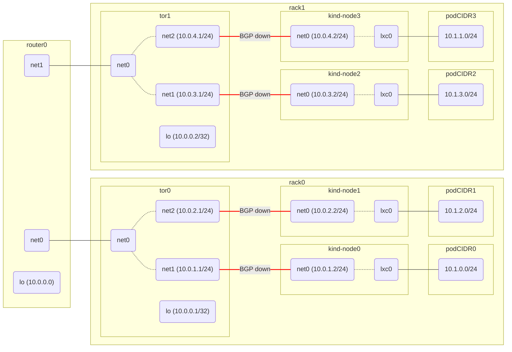

```mermaid

flowchart LR
  subgraph router0
    router0:net0("net0")
    router0:net1("net1")
    router0:lo("lo (10.0.0.0)")
  end
  router0:net0---tor0:net0
  router0:net1---tor1:net0
  subgraph rack0
    subgraph tor0
      tor0:net0("net0")
      tor0:net1("net1 (10.0.1.1/24)")
      tor0:net2("net2 (10.0.2.1/24)")
      tor0:lo("lo (10.0.0.1/32)")
    end
    subgraph kind-node0
      kind-node0:net0("net0 (10.0.1.2/24)")
      kind-node0:lxc0("lxc0")
    end
    subgraph kind-node1
      kind-node1:net0("net0 (10.0.2.2/24)")
      kind-node1:lxc0("lxc0")
    end
    subgraph podCIDR0
      pod0:eth0("10.1.0.0/24")
    end
    subgraph podCIDR1
      pod1:eth0("10.1.2.0/24")
    end
    tor0:net0-.-tor0:net1
    tor0:net0-.-tor0:net2
    tor0:net1---|BGP down|kind-node0:net0
    tor0:net2---|BGP down|kind-node1:net0
    kind-node0:net0-.-kind-node0:lxc0
    kind-node1:net0-.-kind-node1:lxc0
    kind-node0:lxc0---pod0:eth0
    kind-node1:lxc0---pod1:eth0
  end

  subgraph rack1
    subgraph tor1
      tor1:net0("net0")
      tor1:net1("net1 (10.0.3.1/24)")
      tor1:net2("net2 (10.0.4.1/24)")
      tor1:lo("lo (10.0.0.2/32)")
    end
    subgraph kind-node2
      kind-node2:net0("net0 (10.0.3.2/24)")
      kind-node2:lxc0("lxc0")
    end
    subgraph kind-node3
      kind-node3:net0("net0 (10.0.4.2/24)")
      kind-node3:lxc0("lxc0")
    end
    subgraph podCIDR2
      pod2:eth0("10.1.3.0/24")
    end
    subgraph podCIDR3
      pod3:eth0("10.1.1.0/24")
    end
    tor1:net0-.-tor1:net1
    tor1:net0-.-tor1:net2
    tor1:net1---|BGP down|kind-node2:net0
    tor1:net2---|BGP down|kind-node3:net0
    kind-node2:net0-.-kind-node2:lxc0
    kind-node3:net0-.-kind-node3:lxc0
    kind-node2:lxc0---pod2:eth0
    kind-node3:lxc0---pod3:eth0
  end
  linkStyle 4,5,12,13 stroke-width:2px,fill:none,stroke:red;
```
